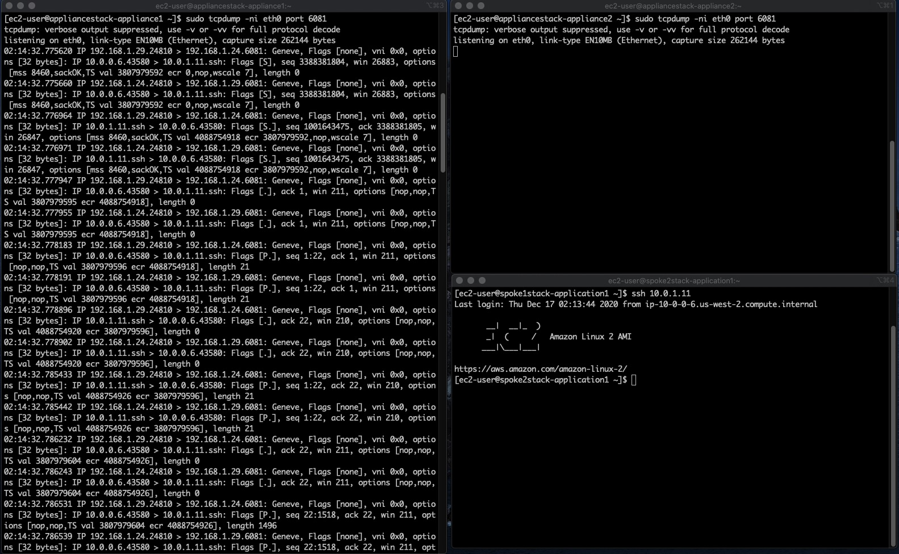
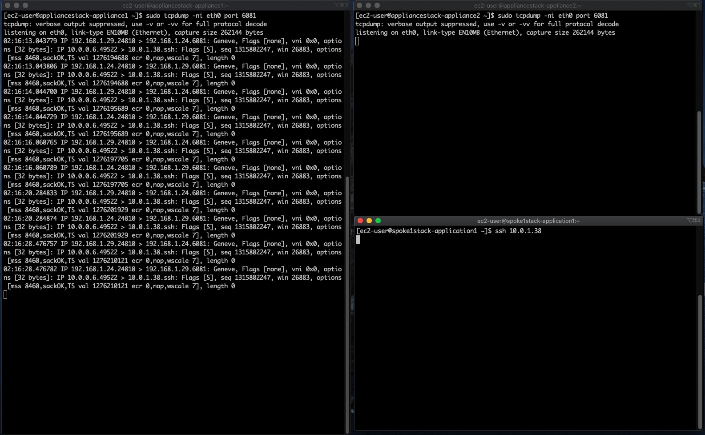
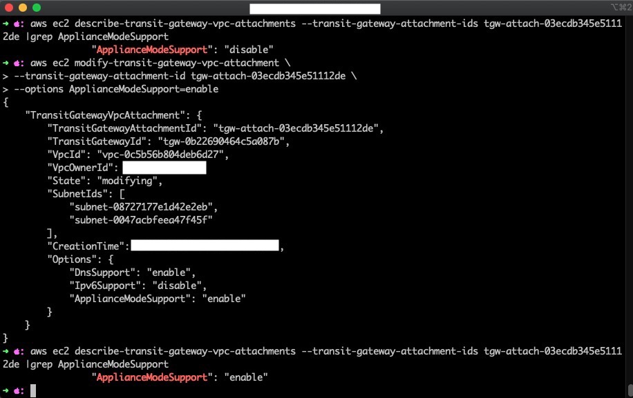
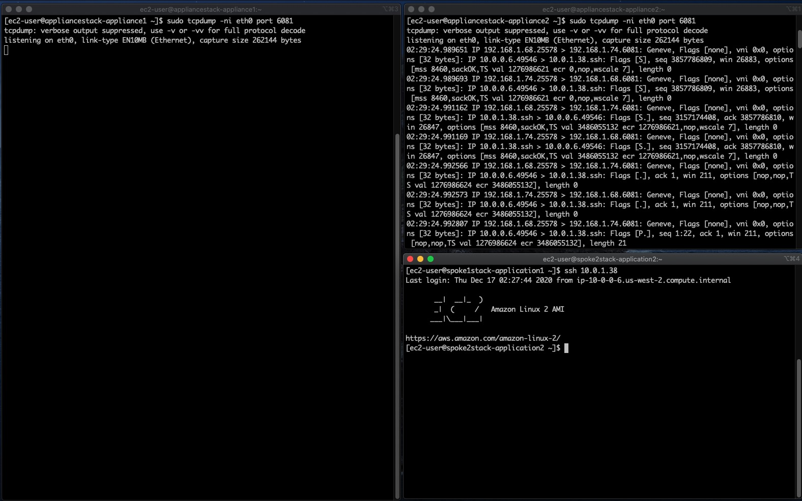
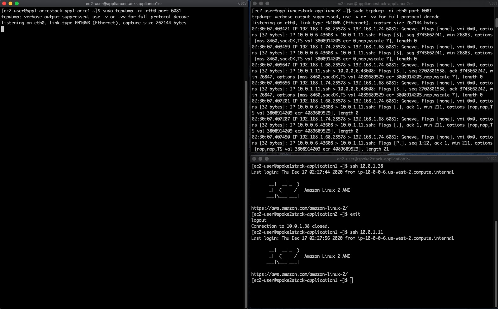

## AWS Gateway Load Balancer Centralized Architecture Validation

### Welcome

* This section walks you through steps to validate AWS Gateway Load Balancer Centralized Architecture.

### Validate access to resource on Internet from application running in Spoke1 VPC:

* From Appliance VPC stack Outputs tab, get the public IP address of the bastion host and private IP addresses of the two appliances:


```sh
key_file=key
stack_name=GwlbCentralizedDemo
region_name=us-east-2
sub_stack_name=$(aws cloudformation describe-stack-resources \
  --stack-name $stack_name --region $region_name |\
  jq -r '.StackResources[].PhysicalResourceId' |\
  awk -F'/' '{print $2}')
tgw_stack_name=$(echo $sub_stack_name |xargs -n 1 |grep 'TgwStack')
appliance_stack_name=$(echo $sub_stack_name |xargs -n 1 |grep 'ApplianceVpcStack')
spoke1_stack_name=$(echo $sub_stack_name |xargs -n 1 |grep 'Spoke1VpcStack')
spoke2_stack_name=$(echo $sub_stack_name |xargs -n 1 |grep 'Spoke2VpcStack')

echo "export key_file=$key_file" >> ~/.bash_profile
echo "export stack_name=$stack_name" >> ~/.bash_profile
echo "export tgw_stack_name=$tgw_stack_name" >> ~/.bash_profile
echo "export appliance_stack_name=$appliance_stack_name" >> ~/.bash_profile
echo "export spoke1_stack_name=$spoke1_stack_name" >> ~/.bash_profile
echo "export spoke2_stack_name=$spoke2_stack_name" >> ~/.bash_profile
echo "alias ssh='ssh -o StrictHostKeyChecking=no'" >> ~/.bash_profile
source ~/.bash_profile

# get addresses
appliance_bastion_pub_ip=$(aws cloudformation describe-stacks \
  --stack-name $appliance_stack_name \
  --query  "Stacks[0].Outputs[?OutputKey=='ApplianceBastionHostPublicIp'].OutputValue" \
  --output text)
appliance1_priv_ip=$(aws cloudformation describe-stacks \
  --stack-name $appliance_stack_name \
  --query  "Stacks[0].Outputs[?OutputKey=='Appliance1PrivateIp'].OutputValue" \
  --output text)
appliance2_priv_ip=$(aws cloudformation describe-stacks \
  --stack-name $appliance_stack_name \
  --query  "Stacks[0].Outputs[?OutputKey=='Appliance2PrivateIp'].OutputValue" \
  --output text)

echo "export appliance_bastion_pub_ip=$appliance_bastion_pub_ip" >> ~/.bash_profile
echo "export appliance1_priv_ip=$appliance1_priv_ip" >> ~/.bash_profile
echo "export appliance2_priv_ip=$appliance2_priv_ip" >> ~/.bash_profile

# put connection to appliance1
cat $key_file |\
  ssh ec2-user@$appliance_bastion_pub_ip -i $key_file \
    'cat - > /tmp/key ; chmod 600 /tmp/key'
echo "ssh ec2-user@$appliance1_priv_ip -i /tmp/key" |\
  ssh ec2-user@$appliance_bastion_pub_ip -i $key_file \
    'cat - > ~/connect-to-appliance1.sh ; chmod a+x ~/connect-to-appliance1.sh'
echo "ssh ec2-user@$appliance2_priv_ip -i /tmp/key" |\
  ssh ec2-user@$appliance_bastion_pub_ip -i $key_file \
    'cat - > ~/connect-to-appliance2.sh ; chmod a+x ~/connect-to-appliance2.sh'

# get addresses
spoke1_bastion_pub_ip=$(aws cloudformation describe-stacks \
  --stack-name $spoke1_stack_name \
  --query  "Stacks[0].Outputs[?OutputKey=='SpokeBastionHostPublicIp'].OutputValue" \
  --output text)
spoke1_application1_priv_ip=$(aws cloudformation describe-stacks \
  --stack-name $spoke1_stack_name \
  --query  "Stacks[0].Outputs[?OutputKey=='SpokeApplication1PrivateIp'].OutputValue" \
  --output text)
spoke1_application2_priv_ip=$(aws cloudformation describe-stacks \
  --stack-name $spoke1_stack_name \
  --query  "Stacks[0].Outputs[?OutputKey=='SpokeApplication2PrivateIp'].OutputValue" \
  --output text)

echo "export spoke1_bastion_pub_ip=$spoke1_bastion_pub_ip" >> ~/.bash_profile
echo "export spoke1_application1_priv_ip=$spoke1_application1_priv_ip" >> ~/.bash_profile
echo "export spoke1_application2_priv_ip=$spoke1_application2_priv_ip" >> ~/.bash_profile

# put connection to spoke1
cat $key_file |\
  ssh ec2-user@$spoke1_bastion_pub_ip -i $key_file \
    'cat - > /tmp/key ; chmod 600 /tmp/key'
echo "ssh ec2-user@$spoke1_application1_priv_ip -i /tmp/key" |\
  ssh ec2-user@$spoke1_bastion_pub_ip -i $key_file \
    'cat - > ~/connect-to-application1.sh ; chmod a+x ~/connect-to-application1.sh'
echo "ssh ec2-user@$spoke1_application2_priv_ip -i /tmp/key" |\
  ssh ec2-user@$spoke1_bastion_pub_ip -i $key_file \
    'cat - > ~/connect-to-application2.sh ; chmod a+x ~/connect-to-application2.sh'

source ~/.bash_profile

```

* Access appliances through bastion host:


```sh
source ~/.bash_profile

# connect to appliance1
ssh ec2-user@$appliance_bastion_pub_ip -i $key_file
./connect-to-appliance1.sh

sudo tcpdump -ni eth0 port 6081

```

```sh
source ~/.bash_profile

# connect to appliance2
ssh ec2-user@$appliance_bastion_pub_ip -i $key_file
./connect-to-appliance2.sh

sudo tcpdump -ni eth0 port 6081

```

* From Spoke1 VPC stack Outputs tab, get the public IP address of the bastion host and private IP addresses of the application instance:


* Access application instance through bastion host:


```sh
source ~/.bash_profile

ssh ec2-user@$spoke1_bastion_pub_ip -i $key_file
./connect-to-application1.sh

ping 8.8.8.8

```

#### Ping:

* On both the appliances capture GENEVE traffic using tcpdump.
* From application instance running in Spoke1 VPC, ping a resource on the internet.
* Ping is successful and ICMP traffic is sent to appliance using GENEVE.


#### HTTP:

* On both the appliances capture GENEVE traffic using tcpdump.
* From application instance running in Spoke1 VPC, access a resource on the Internet over HTTP.
* Example below uses a curl command to access simple webserver running on an EC2 instance. Command is successfull. HTTP traffic is sent to appliance using GENEVE.


### Validate access to application running in Spoke2 VPC from application running in Spoke1 VPC (East-West/VPC-to-VPC):

* As explained in the [ Centralized inspection architecture with AWS Gateway Load Balancer and AWS Transit Gateway blog](https://aws.amazon.com/blogs/networking-and-content-delivery/centralized-inspection-architecture-with-aws-gateway-load-balancer-and-aws-transit-gateway/), to ensure flow symmetry, Transit Gateway appliance mode should be enabled on the Appliance VPC attachment. In example below, application instance in Availability Zone (AZ) A of Spoke1 VPC tries to SSH into application instances in AZ A and AZ C of Spoke2 VPC.

* [reference blog](https://aws.amazon.com/blogs/networking-and-content-delivery/introducing-aws-gateway-load-balancer-supported-architecture-patterns/#:~:text=With%20the%20AWS%20Transit%20Gateway%20appliance,Transit%20Gateway%20appliance%20mode%C2%A0here.)

* From Spoke2 VPC stack Outputs tab, get the private IP addresses of the application instances:


#### Transit Gateway appliance mode disabled:

* With Transit Gateway appliance mode disabled, application instance in AZ A of Spoke1 VPC is able to access application instance in AZ A of Spoke2 VPC over SSH.



* Since application instance in AZ C of Spoke2 VPC is in a different AZ, it is not accessible.



#### Transit Gateway appliance mode enabled:

* From Transit Gateway stack Outputs tab, get the Appliance VPC attahcment ID:


* Enable Tranist Gateway appliance mode for the Appliance VPC attachment:



* With Transit Gateway appliance mode enabled, application instance in AZ A of Spoke1 VPC is able to access both the application instances in Spoke2 VPC over SSH.

* Application instance in AZ A of Spoke2 VPC:



* Application instance in AZ C of Spoke2 VPC:


