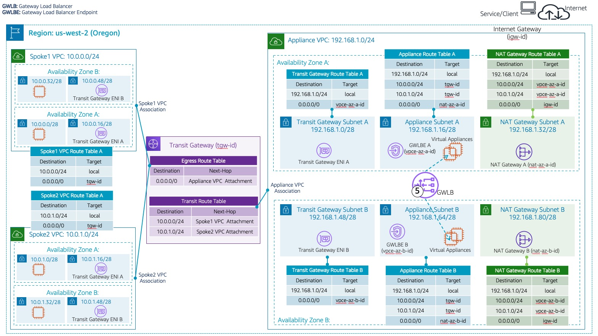

## AWS Gateway Load Balancer In Centralized Architecture ([original](https://github.com/aws-samples/aws-gateway-load-balancer-code-samples/tree/main/aws-cloudformation/centralized_architecture))

### 概述

* 本部分包含 AWS Cloudformation 模板示例，演示创建集中防火墙检测架构
  * AWS Gateway Load Balancer (GWLB)
  * AWS Gateway Load Balancer Endpoints (GWLBe)
  * 模拟设备(virtual appliances)
  * AWS Transit Gateway (TGW)

* 查看这篇blog以获取更多信息: **[Centralized inspection architecture with AWS Gateway Load Balancer and AWS Transit Gateway](https://aws.amazon.com/blogs/networking-and-content-delivery/centralized-inspection-architecture-with-aws-gateway-load-balancer-and-aws-transit-gateway/)**


_Figure 1: GWLB Centralized Architecture_

* 按照以下顺序部署 cloudformation 模版
  1. Appliance VPC 模版
  2. Spoke1 VPC 模版
  3. Spoke2 VPC 模版
  4. Transit Gateway 模版. 此模版依赖于前三个模版成功部署.
* 或者直接部署 **一键部署** 模版

### **Appliance VPC**
* [GWLB Appliance VPC 示例](CentralizedArchitectureApplianceVpc2Az.yaml)

### **Spoke VPCs**
* 我们对 Spoke1 VPC 和 Spoke2 VPC 使用相同的 Spoke VPC 模板。 为 Spoke2 VPC 部署模板时，请确保您已更改默认值，以便 Spoke2 VPC 具有不同的 VPC 和相关子网网络地址。
  * [GWLB Spoke1 VPC 示例](CentralizedArchitectureSpokeVpc2Az.yaml)
  * [GWLB Spoke2 VPC 示例](CentralizedArchitectureSpokeVpc2Az.yaml)

### **Transit Gateway**
* [GWLB Transit Gateway 示例](CentralizedArchitectureTgw.yaml)
  * 为参数选择合适的值
  * 查看 Appliance VPC 和 Spoke VPCs 的 Output 获取值
  * 启用 Transit Gateway appliance 模式

### Enable Transit Gateway Appliance Mode:

* [GWLB Transit Gateway Sample](CentralizedArchitectureTgw.yaml)
  * 为了确保对称的数据流, 在连接 Appliance VPC 的 attachment 上启用 Transit Gateway 的 appliance 模式 
  * 您还可以使用 AWS CLI 启用/禁用 appliance 模式。 成功部署 Transit Gateway 模板后，从堆栈的输出选项卡中获取设备 VPC Attachment ID，并使用 AWS CLI 启用/禁用 appliance 模式，如下所示。 将 '< >' 内的参数值替换为适当的值

```bash
aws ec2 modify-transit-gateway-vpc-attachment \
    --transit-gateway-attachment-id <tgw-attach-0253EXAMPLE>
    --options ApplianceModeSupport=enable
```

### 一键部署
* 部署会创建 3 个 vpc ，确保你有足够的 service quota 
* 在你期望部署的区域中新建 key pair，使用 pem 格式，并保存 private key
* 直接部署 [gwlb centralized architecture stack](https://us-west-2.console.aws.amazon.com/cloudformation/home?region=us-west-2#/stacks/create/template?stackName=GwlbCentralizedDemo&templateURL=https://tech-content-us-west-2.s3-us-west-2.amazonaws.com/aws-gwlb-cloudformation-samples/centralized-architecture/nested-stack/CentralizedArchitecturePrimary.yaml)，它将创建图 1 中所述的所有资源
  * 虽然上面的链接在俄勒冈 (us-west-2) 区域启动堆栈，但您可以将区域更改为您的选择。 确保您选择在其中部署堆栈的区域支持 GWLB。
  * 部署模版时：1）指定两个不同的可用区；2）指定 key pair

* 我的版本修复了一些SG的问题 [link](https://us-west-2.console.aws.amazon.com/cloudformation/home?region=us-west-2#/stacks/create/template?stackName=GwlbCentralizedDemo&templateURL=https://panlm-br-1350.s3.us-east-2.amazonaws.com/CentralizedArchitecturePrimary.yaml)
* 另外还有一个适用于中国区的版本 [link](https://cn-northwest-1.console.amazonaws.cn/cloudformation/home?region=cn-northwest-1#/stacks/create/template?stackName=GwlbCentralizedDemo&templateURL=https://panlm-br-1350.s3.us-east-2.amazonaws.com/cn/CentralizedArchitecturePrimary.yaml)

* 你可以找到所有模版文件在[nested-stack](nested-stack)目录下

### 验证步骤:
* [GWLB Centralized Architecture Validation](CentralizedArchitectureValidation.md)


