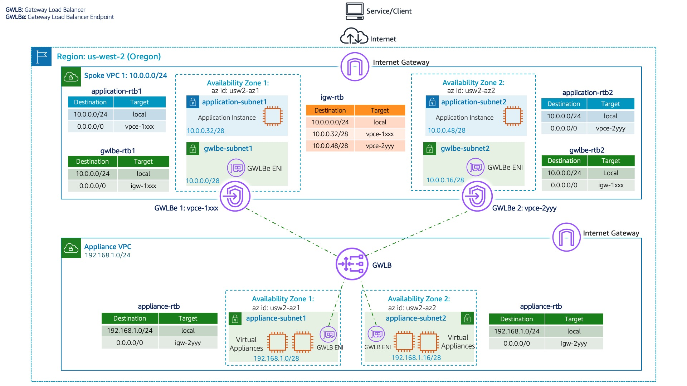

### AWS Gateway Load Balancer In Distributed Architecture

[source](https://github.com/aws-samples/aws-gateway-load-balancer-code-samples/tree/main/aws-cloudformation/distributed_architecture)

## Welcome

* For more details, refer to blog: **[Scaling network traffic inspection using AWS Gateway Load Balancer](https://aws.amazon.com/blogs/networking-and-content-delivery/scaling-network-traffic-inspection-using-aws-gateway-load-balancer/)**

* This section contains sample AWS Cloudformation templates that demonstrates how to create distributed architecture using AWS Gateway Load Balancer and Gateway Load Balancer Endpoints from templates that are written in YAML.

 * **Launch GWLB Appliance VPC Sample template before launching GWLB Spoke VPC Sample template.**
   * Appliance creates VPC Endpoint Service Name required for the Spoke VPC. Spoke VPC creates Gateway Load Balancer Endpoint using the VPC Endpoint Service created by Appliance VPC 

### **Appliance VPC:**
* 创建ssh key
* 部署cloudformation模版
  * [GWLB Appliance VPC Sample](DistributedArchitectureApplianceVpc2Az.yaml)
  * 指定：stack名称、选择2个不同的region、选择ssh key，其他保持默认
  * 开始创建
* 记录service name，下一步需要
  * `vpc` --> `endpoint services` --> `service name`

### **Spoke VPC:**
* 部署cloudformation模版
  * [GWLB Spoke VPC Sample](DistributedArchitectureSpokeVpc2Az.yaml)
  * 指定：stack名称、选择2个不同的region、选择ssh key、输入上一步获取的service name，其他保持默认
  * 开始创建
